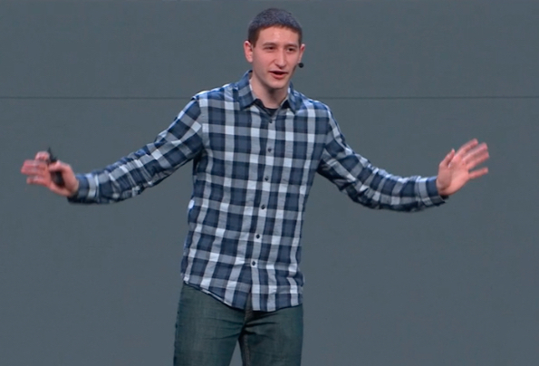
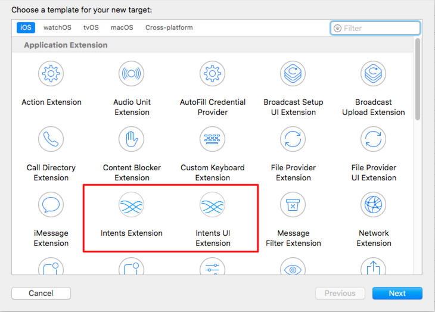
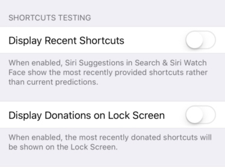
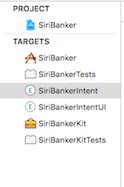
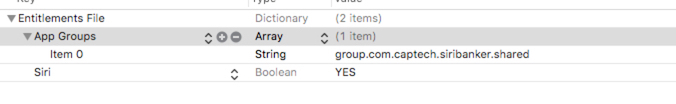
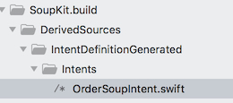
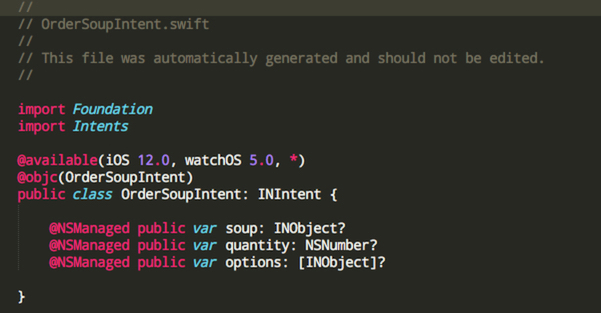
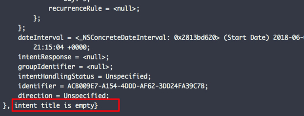
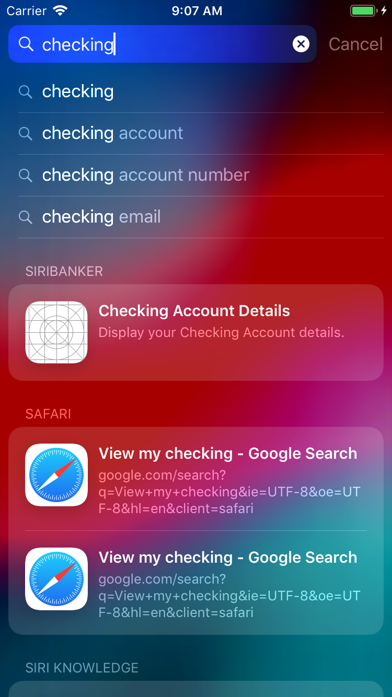

# First Look: Siri Shortcuts

### Introduction

The common impression is that Siri does not compare with Alexa and Google Voice.  Siri seems stuck in the past compared to its rivals.  Voice assistants are OK for general information like Wikipedia or weather or sports, but they lag when it comes to *personal* information.  

WWDC 2018, with one of the most enthusiastic presenters in memory, changes all that.

### 25 Extensions and Counting

Every year Apple comes up with new ways for apps to integrate themselves within the operating system.  There are now 25 different extensions you can add to an app to keep it from *getting marooned on the home screen*, ranging from Spotlight search, to Apple Watch extensions, to messages.  

Over the last couple of years, Apple has gradually opened up Siri to developers.  At first the list of voice intents was quite restrictive.  Now apps can generate custom intents to handle just about any kind of user interaction.

### A Problem Never Solved Well by Notifications

The enterprise *tries* to sends useful information via notifications, but most notifications get ignored.  Indeed, app retention has been shown to be inversely proportional to the number of notifications sent.

Siri shortcuts act like a personal notification server for the user.  Siri shortcuts happen when the *user initiates*  actions that are likely to be repeated.  Compared to that, remote notifications seem more like mere guesses.

Given the location, time, and day of the week, that user initiates an action, Siri can suggest that action at a time that makes sense.

Even better, the user can record customized phrases to trigger the Siri shortcuts on demand.  These shortcuts can then be combined with other shortcuts to make a chain of events happen.  What's great about this: all actions are under user control and local to the device.  

### Sample App

You will find our [sample app](https://github.com/CapTechMobile/SiriBanker) on GitHub.  We did all our work on the first beta of iOS 12.  Not everything worked for us as expected.

We call our app `SiriBanker`.  The goal is to build a simple banking app that can display information about multiple accounts.  There is nothing fancy here, not even authentication.  The user can view transactions and make transfers.

We wanted to see how far we could push Siri to:

* View account information
* Make transfers

### Intents

To set up intents, here are a couple of things to get you started.

#### 1. Turn on debug mode for Siri

If you don't do this, you may have to wait a long time to see any Siri suggestions.  In Settings/Developer, eliminate the wait for suggestions to show up by toggling "Display Recent Shortcuts" and "Display Notifications on Lock Screen"

#### 2. Move your business logic to a framework

Users should be able to interact with your app's features without interacting with your app.  This means all your business logic needs to be segregated into its own framework, a framework that both the app and the extension depend upon.  

For our app `SiriBanker`:

* ``SiriBankerKit`` contains all business logic.  
* `SiriBankerIntent` gets called when to handle shortcuts
* `SiriBankerIntentUI` manages display of data after the user taps on the Siri shortcut.  

#### 3. Enable Siri Capability and App Groups

App Groups will be new for customers unaccustomed to sharing data across extensions and app.  *Both* the `SiriBanker` and the `SiriBankerIntent` targets will need an entitlement file that shares the same App Group.

#### 4. Study Soup Kit

Apple provides a great sample app to get started, Soup Chef.  You can download it [here](https://docs-assets.developer.apple.com/published/b2d1b84aff/AcceleratingAppInteractionsWithShortcuts.zip).  

#### 4. Create a custom Intent.

Create a custom intent using the new intent editor.  

This editor actually generates code that appears in your build directory.

Compared to other generated code we've seen, the output isn't half bad.

You can also create system intents using the intent definition file, but we could never get it to work.  We kept getting a 'missing intent title' error each time we tried to donate the intent.  If you figure it out, send us PR!

### User Activity

One new feature is suggested activities via Siri Shortcuts. 
These shortcuts are presented to the user at a time the system considers to be relevant, or when the user searches for a keyword in spotlight search.

In our banking app, we created a shortcut for accessing a user's checking account. When the user completes the action normally by visiting their Checking Account Details view, the app 
creates an NSUserActivity which defines the action, and donates it to the system. Donations like these are tracked internally on the device, and used to suggest the shortcut to the user at an appropriate time.
For example, if a customer of your bank is constantly revisiting their checking account balance at noon every other Friday, Siri and the system will learn this behavior and suggest the action to the user on subsequent Fridays via the lock screen.

Alternatively, if the user searches in spotlight for the phrase or keywords associated with the NSUserActivity, a suggestion will appear in the search results that will navigate the user to the appropriate screen. A screenshot of this functionality is below.

You will have to implement the AppDelegate function `application(_ application: continue userActivity: restorationHandler: ) -> Bool` to handle the user selecting those shortcuts.

### Conclusion and Recommendations

- Shortcuts are an answer to Google assistant, Alexa
- Designed to leverage machine learning to make siri smarter and give developers a way to better integrate their apps into the OS
- Its clear that apple wants your app to be much more than just an icon on the homescreen. Apps now should strive to be seamlessly woven into the device experience
- By using @available tags, you can begin implementing this functionality now, and avoid disrupting current user experiece for users who have not upgraded
- Most will upgrade tho: By Christmas 2018, enerprises can expect that 70% of their customers ...
- Building for this experiece now will put an enterprise ahead of the game and can create an experience that edges out other apps in your space.

//////////////

You can implment it now.  By Christmas 2018, enterprises can expect that 70% of their customers will be running iOS 12.  A year from now, that percentage will be close to 90%.  With the `@Available` tag, our customers can deploy code that 

Siri vs. Alexa

Common knowledge is that Amazon’s Alexa and Google Voice are more powerful than Siri.

But you can’t carry a dot around in your pocket.  There’s no battery.

What makes powerful is that 

Ongoing effort to keep apps from getting forgotten on your home screen.

Sort of a substitute for notifications.

ultra enthusiastic.  jet packs on his shoes.  

70 % of your users are going to be on by the end of the year.

You can use the `@available(iOS 12.0, watchOS 5.0, *)`

To make it work with old users.  So there’s no need to wait.

Missing Intent Title

Siri Shortcuts vs notifications.   

project setup.

 
### Random notes
iOS 12 Only
It may take a year to get your intents up to speed.

There is no reason why you can’t build it in now for the fall.

Missing Title

There’s a banking up there.  Figure out what’s wrong and help us with a PR.

Missing Title

Key steps:
* Entitlments
* App Group
* Turn on Debugging
* 

Where does it go.
  (img)

